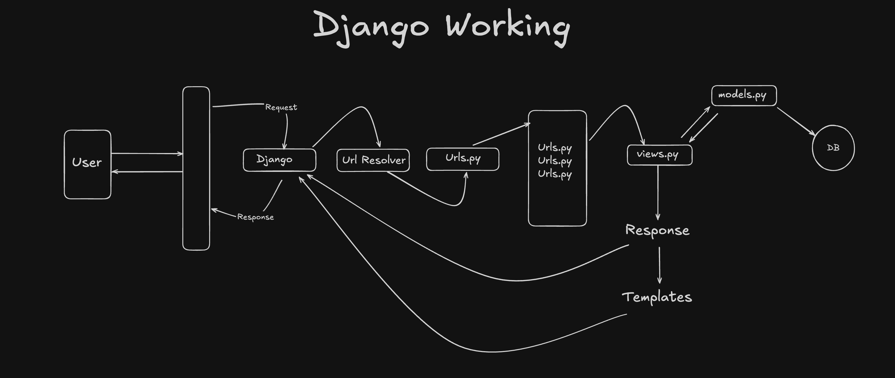

# Django-2 (Chai aur Django)

### Django Wrokflow :



### Folder Structure :

```
static/ - for css and js files
templates/ - only for html templates
```

## Templates

- Being a web framework, Django needs a convenient way to generate HTML dynamically. 

- The most common approach relies on templates. A template contains the static parts of the desired HTML output as well as some special syntax describing how dynamic content will be inserted.

- A Django project can be configured with one or several template engines (or even zero if you don’t use templates). 

- Django ships built-in backends for its own template system, creatively called the Django template language (DTL), and for the popular alternative Jinja2. 

- Backends for other template languages may be available from third-parties. You can also write your own custom backend, see Custom template backend

### Syntax :

1. **Variables :**

- A variable outputs a value from the context, which is a dict-like object mapping keys to values.

- Variables are surrounded by {{ and }} like this:
```py
My first name is {{ first_name }}. My last name is {{ last_name }}.
```

With a context of {'first_name': 'John', 'last_name': 'Doe'}, this template renders to:

```py
My first name is John. My last name is Doe.
```

2. **Tags :**

- Tags provide arbitrary logic in the rendering process.

- This definition is deliberately vague. For example, a tag can output content, serve as a control structure e.g. an “if” statement or a “for” loop, grab content from a database, or even enable access to other template tags.

- Tags are surrounded by  like this:
```py

```

- Most tags accept arguments:
```py

```

- Some tags require beginning and ending tags:
```py
Hello, {{ user.username }}.
```

3. **Filters :**

- Filters transform the values of variables and tag arguments.

- They look like this:
```py
{{ django|title }}
```

- With a context of {'django': 'the web framework for perfectionists with deadlines'}, this template renders to:
```py
The Web Framework For Perfectionists With Deadlines
```

- Some filters take an argument:
```py
{{ my_date|date:"Y-m-d" }}
```

4. **Comments :**

- Comments look like this:
```py
{# this won't be rendered #}
```